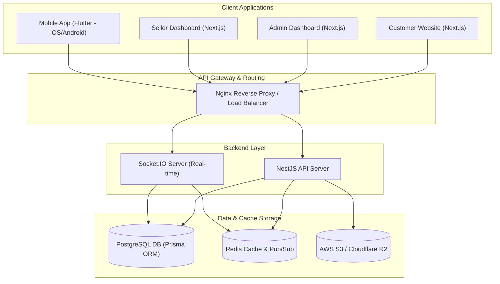

# Veridia E-Commerce Marketplace Architecture

This document describes the high-level architecture, design decisions, data flow, security approach, and deployment topology of **Veridia**—a next-generation, premium, multi-vendor e-commerce marketplace platform.

---

## 1. System Architecture

Veridia is built using a modern multi-app monorepo strategy powered by PNPM workspaces, separating applications while sharing configuration, types, and visual tokens.



### Components Summary
1.  **Flutter Mobile Client:** Compiles to native iOS and Android packages, utilizing Riverpod for state management, Dio for network requests, and GoRouter.
2.  **Next.js Web Applications:** Three decoupled Next.js web applications (customer storefront, admin panel, and seller panel) sharing a TypeScript interface, built with Tailwind CSS and Shadcn UI.
3.  **NestJS Backend REST API:** Monolithic entry point serving DTO-validated endpoints, orchestrating database transactions, payments, JWT issuance, and webhooks.
4.  **Socket.IO Service:** Integrated with NestJS to serve real-time notifications, chat, and order status updates using Redis for horizontal adapter scaling.
5.  **Database & Storage:** PostgreSQL handles relational transactions. Redis is used for key-value session caching, rate limiting, and real-time pub/sub. AWS S3/R2 stores product media assets.

---

## 2. Key Data Flows

### 2.1 Authentication & Registration Flow
```mermaid
sequenceDiagram
    autonumber
    actor User as Client (Web/Mobile)
    participant API as NestJS API
    participant DB as PostgreSQL
    participant Redis as Redis Cache

    User->>API: POST /auth/signup (with credentials & Role)
    API->>DB: Check if user exists; hash password; save user
    DB-->>API: User created
    API->>User: Success response (Redirect to Login)

    User->>API: POST /auth/login (with credentials)
    API->>DB: Verify email & check password hash
    DB-->>API: Validated User record
    API->>Redis: Store refresh token session (UUID mapping)
    API->>User: Set HttpOnly cookie (Refresh) + return JWT Access Token (JWT payload includes role)
```

### 2.2 Multi-Vendor Order & Checkout Flow
1.  **Cart Preparation:** Customer compiles items from multiple vendors. Cart is synced to the backend database.
2.  **Checkout Initialization:** Customer selects address and hits Checkout. NestJS locks inventory and creates a `PENDING` order.
3.  **Payment Processing:** Customer pays via Paystack/Stripe. Paystack/Stripe sends a webhook to NestJS.
4.  **Order Splitting:** NestJS splits the master order into separate seller-specific orders, creates wallet transactions (pending commission extraction), and sends Socket.IO notifications to relevant sellers instantly.
5.  **Seller Fullfillment:** Seller accepts and ships the order. Real-time GPS/courier tracking coordinates update via websocket to the customer mobile/web app.

---

## 3. Security Design

Veridia implements a defense-in-depth model across the entire application stack:

-   **Role-Based Access Control (RBAC):** NestJS guards validate JWT payloads on protected routes. Roles (`CUSTOMER`, `SELLER`, `ADMIN`, `SUPER_ADMIN`) are checked at the decorator level.
-   **JWT Token Rotation:** Access tokens are short-lived (15 minutes). Refresh tokens are stored in `HttpOnly` Secure cookies (or encrypted storage on mobile) and validated against a Redis whitelist to support instant revocation.
-   **SQL Injection & XSS Mitigation:** Prisma ORM parameterized query building protects against SQL Injection. NestJS `ValidationPipe` (via `class-validator`) sanitizes incoming payloads.
-   **API Rate Limiting:** Redis-backed Throttling guards against brute-force attacks on sensitive endpoints (e.g., `/auth/login`, `/checkout`).
-   **Secure File Uploads:** NestJS validates mime-types and file sizes before streaming uploads to S3/R2, generating pre-signed URLs to protect read access.

---

## 4. Deployment Topology

The infrastructure is orchestrated using Docker and deployed via a secure, automated CI/CD pipeline:

```
                  ┌──────────────────────┐
                  │   DNS (Cloudflare)   │
                  └──────────┬───────────┘
                             │ (HTTPS)
                             ▼
                  ┌──────────────────────┐
                  │  Nginx Load Balancer │
                  └──────────┬───────────┘
                             │
            ┌────────────────┴────────────────┐
            │ (Reverse Proxy)                 │ (Reverse Proxy)
            ▼                                 ▼
┌───────────────────────┐         ┌───────────────────────┐
│  NestJS Instance 1    │         │  NestJS Instance 2    │
│  (Docker Container)   │         │  (Docker Container)   │
└───────────┬───────────┘         └───────────┬───────────┘
            │                                 │
            ├───────────────┬─────────────────┤
            │               │                 │
            ▼               ▼                 ▼
┌───────────────┐   ┌───────────────┐   ┌───────────────┐
│  PostgreSQL   │   │  Redis Cache  │   │  AWS S3 / R2  │
│  Primary DB   │   │  & Pub/Sub    │   │  Asset Store  │
└───────────────┘   └───────────────┘   └───────────────┘
```

-   **CI/CD Pipeline:** GitHub Actions runs automated tests (Jest, Flutter analyzer), builds Docker images, and pushes them to AWS ECR / GitHub Packages.
-   **Production Runtime:** Nginx handles SSL termination, gzip compression, and routes traffic across multiple load-balanced API container instances.
-   **Containerization:** All services (NestJS, Next.js web applications, database instances) are isolated inside Docker containers, managed via compose scripts in staging and Kubernetes in production.
